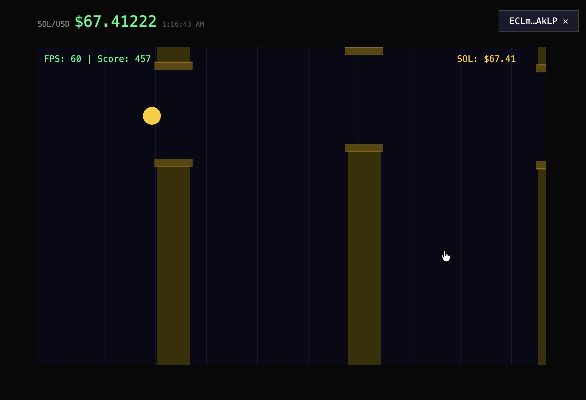

# 🐂 Flappy Bull

**Flappy Bird meets the SOL/USD chart.** Keep the Bull alive inside a scrolling price channel — tap to float, survive the volatility, and land your score on the **live on-chain leaderboard**.



---

## How It Works

Flappy Bull turns the live SOL price into a game. The price line is the safe zone — the channel scrolls with real market movement. Pumps push the ceiling up, dumps drop the floor. One tap = one flap. Touch the walls and you're liquidated.

Your score streams to a **shared, real-time leaderboard** during the run and settles permanently on Solana when you crash. No wallet prompts mid-game — a session key signs everything in the background.

### Trustless Scoring

The game uses a **single-source deterministic physics engine** shared between browser and chain:

```
sim-core (Rust, #![no_std])
    ├── wasm32  →  browser client  (60 fps predictor)
    ├── sbf     →  on-chain program (replay authority)
    └── native  →  dev/test
```

The on-chain program **replays** every tick of your run using the same `step()` function the browser used. The score the program computes is canonical — the client can lie, but the chain won't care. No floats, no `Math.random`, no cross-language drift. One crate, three targets, identical output byte-for-byte.

---

## Architecture

```
┌─ Browser ───────────────────────────────────────────────────┐
│  React (Vite)  —  shell, wallet, HUD, leaderboard           │
│  PixiJS (WebGL)  —  tunnel, Bull, particles, juice          │
│  sim-core (WASM)  —  physics predictor, 60 fps              │
│  Session keypair  —  signs ER writes, zero wallet prompts   │
└──────────┬──────────────────────────────────────────────────┘
           │ SOL/USD price                 │ stream taps (session key)
           ▼                               ▼
┌──────────────────┐     ┌────────────────────────────────────┐
│  MagicBlock      │     │  Ephemeral Rollup                  │
│  Pricing Oracle  │     │  GameSession PDA (live sim state)  │
│  (Pyth Lazer)    │     │  ~10-50ms writes, gasless via ER   │
└──────────────────┘     └────────────┬───────────────────────┘
                                      │ commit + undelegate
                                      ▼
                           ┌────────────────────────────────────┐
                           │  Solana devnet                     │
                           │  Leaderboard PDA (top-10 all-time) │
                           │  SeasonParams PDA                  │
                           └────────────────────────────────────┘
```

### On-Chain Program

**Program ID:** `HvwtseJuzu9XzWQ9Xh323BTVqvwpywHz16PAduoQs8vS` (devnet)

| Instruction | Layer | Description |
|---|---|---|
| `start_run` | base | Initialize `GameSession` PDA, stamp session key |
| `delegate` | base | Delegate `GameSession` to the Ephemeral Rollup |
| `submit_tap` | ER | Advance sim state one tick (tap, price). Session-key auth. Gasless. |
| `finish_run` | ER | Simulate to death → `commit_and_undelegate` → persist to base layer |
| `update_leaderboard` | base | Insert final score into top-10 leaderboard, sorted descending |

### PDAs

| Account | Seeds | Layer |
|---|---|---|
| `GameSession` | `["session", player]` | ER (delegated) → base (after commit) |
| `SeasonParams` | `["season"]` | base |
| `Leaderboard` | `["lb"]` | base |

---

## Tech Stack

| Layer | Tech |
|---|---|
| UI shell | React + Vite + TypeScript |
| Renderer | PixiJS (WebGL 2D) |
| Physics engine | `sim-core` — Rust compiled to WASM (client) + SBF (chain) |
| Wallet | `@solana/wallet-adapter` (Phantom) |
| Session keys | Ephemeral `Keypair` — throwaway, gasless ER signer |
| Solana framework | Anchor 1.0.2 + `@coral-xyz/anchor` 0.32.1 |
| Rollup SDK | `@magicblock-labs/ephemeral-rollups-sdk` 0.14.3 |
| Price feed | MagicBlock pricing oracle (Pyth Lazer SOL/USD) |
| Network | Solana devnet + MagicBlock ER devnet |

---

## Getting Started

### Prerequisites

- **Rust** (stable, with `wasm32-unknown-unknown` target)
- **Solana CLI** + **Anchor** 1.0.2+
- **Node.js** 20+
- **wasm-pack** 0.15+

```bash
# Rust WASM target
rustup target add wasm32-unknown-unknown

# wasm-pack
curl https://rustwasm.github.io/wasm-pack/installer/init.sh -sSf | sh

# Anchor (via avm)
cargo install --git https://github.com/coral-xyz/anchor avm
avm install 1.0.2
avm use 1.0.2
```

### Build

```bash
# 1. Build sim-core → WASM (browser client)
wasm-pack build \
  --target web \
  --out-dir ../app/src/wasm/sim-core \
  sim-core \
  -- --features wasm

# 2. Build on-chain program
anchor build

# 3. Copy IDL to app
npm run copy-idl

# 4. Install frontend deps
cd app && npm install
```

### Run (devnet)

```bash
# Start frontend dev server
cd app && npm run dev
```

Open `http://localhost:5173`. Connect a Phantom wallet (set to devnet), start a run, and tap.

### Test

```bash
# sim-core unit + golden + identity
cargo test -p sim-core

# sim-core cross-build determinism (wasm32 == native)
wasm-pack test --node sim-core --features wasm

# Lint
cargo clippy -p sim-core -- -D warnings

# Anchor program
anchor test --provider.cluster devnet
```

---

## Project Status

MVP is live on devnet. There are plans to improve cosmetics, gamify logic, add reward and monetization layers.

See [ROADMAP.md](ROADMAP.md) for the full build plan and [PRD.md](PRD.md) for product requirements.

---

## License

MIT
